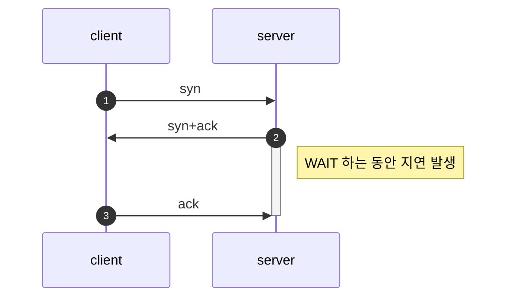

* TOC
{:toc}

이 문서는 [이해하면 인생이 바뀌는 TCP 송/수신 원리
](https://www.youtube.com/watch?v=K9L9YZhEjC0&list=PPSV)에 있는 영상 내용을 요약한 것이다.

### 영상 내용 요약

Server는 Process. Process가 파일에 할 수 있는 오퍼레이션은 기본적으로 RWX

- 소켓에서 Read와 Write는 다르게 부름 (Receive, Send)

서버를 어떤 언어로 개발하든, 서버에 메모리를 할당하게 된다.

- 파일의 크기가 1.4MB일때, 메모리를 얼마나 할당할지는 개발자가 결정 (서버 프로세스를 개발한 개발자)
- 메모리를 64KB 할당했다고 가정
- 64KB만큼 메모리를 끊어서 메모리에 적재하는 방식


세그먼트(segment): 메모리에서 버퍼로 읽어올 때, 이를 잘게 쪼개고 번호를 붙인 것!

```
|---|---|---|
| 1 | 2 | 3 |
|---|---|---|
```
- 각각의 세그먼트는 번호가 붙는다. (실제 번호 체계는 이렇게 단순하지는 않다.)

패킷이란 택배 박스와 원리가 유사
- 택배 박스에 세그먼트를 집어넣는 것
- 택배 박스를 트럭에 전달. 이는 `프레임`이라고 함
- 트럭을 계속 갈아탐. 즉 프레임이 있었다가 없어졌다를 반복

보통 클라이언트 측에서 2개 정도의 세그먼트를 수신하면, 서버에게 잘 받았다라고 ACK#3 하고 수신을 하게됨.

- 뒤에 붙는 번호는 보낸 세그먼트의 숫자 + 1
- 서버 측에서는 세그먼트를 송신하고, 클라이언트 측에서 ACK 응답이 올때까지 기다리게 되는데(WAIT), **이 기다리는 시간이 대부분 TCP에서 시간이 오래 걸리는 비중의 대부분을 차지한다.**

여기서 TCP 3-Way HandShake 과정이 생각났다.



Window Size: 수신 측에서 받은 세그먼트를 제외한 나머지 용량

- 수신측에서는 ACK를 보낼 때 이 Window Size도 같이 보낸다.
- **받은 Window Size에 따라 보낼지 말지를 수신측에서 결정하는데, 사이즈가 모자라다면 보내지 않는다!!!**
- `수신측 Window Size > 송신측의 MSS (Maxium Segment Size)` 체크
	- YES: 보냄
	- NO: WAIT가 걸린다.
- 프로그램이 느리다: 수신측의 Window Size가 부족한 것일 수도 있다.

*Client측의 Read 속도가 Network에서 수신하는 속도보다 빨라야된다. 그렇지 아니면 TCP Buffer가 계속 차게되어 WAIT하는 시간이 길어진다.*

### 나머지 참고할 내용

- 소켓이라는 것은 TCP/IP를 추상화 한 것
- TCP에서 내려올 때 IP로 변한다
- 소켓의 본질은 파일

