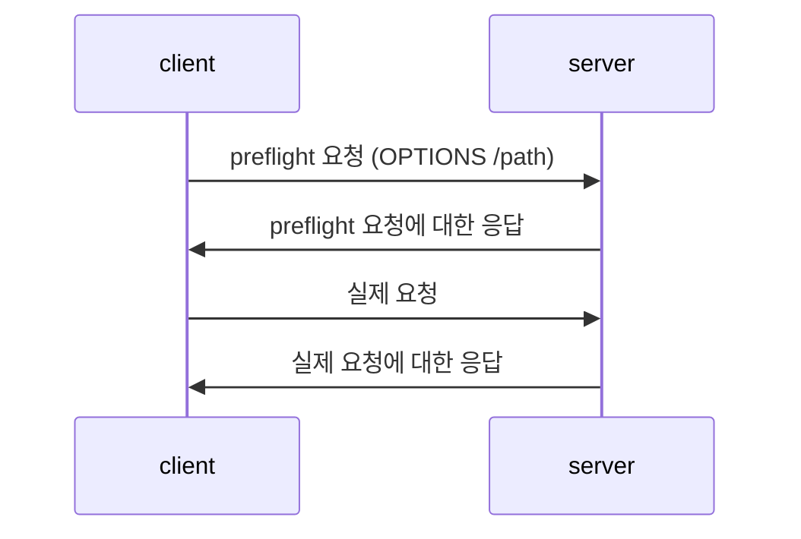

* TOC
{:toc}

### CORS란

CORS(cross origin resource sharing)는 다른 출처의 리소스를 허용하기 위해 만들어진 정책이다.

여러 서비스들과 연동이 필요해지면서 다른 출처의 자원들도 필요하기 시작했고, 서버에서 허용 시 일부 자원을 쓸 수 있도록 허용하는 정책이다.

- CORS가 등장하기 전에는 SOP(same origin policy)라는 것을 통해 동일한 출처에 대한 자원 요청만을 허용했다.

CORS는 조건이 충족되지 않을 경우 브라우저가 서버에게 실제 요청이 가지 않도록 설계되었다. 자원을 변경하는 요청의 경우 이미 요청을 보내고 브라우저 상에서 에러를 발생해도 서버 상에서 이미 자원이 변경된 상태가 되기 때문이다.
### 과정

OPTIONS 메서드를 통해 Preflight 요청을 먼저 보내고, 실제 요청을 보낸다.



### CORS 요청/응답 헤더

CORS 요청, 응답 시 마다 Header를 서로 주고받는다.

request
```bash
Origin: <origin>
```
- `Origin`: PreFilight 요청의 Origin 주소

response
```bash
Access-Control-Allow-Origin: https://mozilla.org
Access-Control-Allow-Methods: GET, POST
Access-Control-Allow-Headers: X-PINGOTHER, Content-Type
Access-Control-Max-Age: 86000
```

- `Access-Control-Allow-Origin`: 서버가 허용할 주소
- `Access-Control-Allow-Methods`: 서버가 허용할 HTTP 메서드들
- `Access-Control-Allow-Headers`: 서버가 허용할 HTTP Header들
- `Access-Control-Max-Age`: PreFlight 요청을 얼마동안 캐시할 지

### 단순 요청 (Simple Request)

일부 조건 충족 시 CORS Preflight 요청을 보내지 않는다. [(문서 참고)](https://developer.mozilla.org/ko/docs/Web/HTTP/CORS#%EB%8B%A8%EC%88%9C_%EC%9A%94%EC%B2%ADsimple_requests)

### 참고

- <https://developer.mozilla.org/ko/docs/Web/HTTP/CORS>
- <https://www.youtube.com/watch?v=-2TgkKYmJt4>
- <https://hannut91.github.io/blogs/infra/cors>
