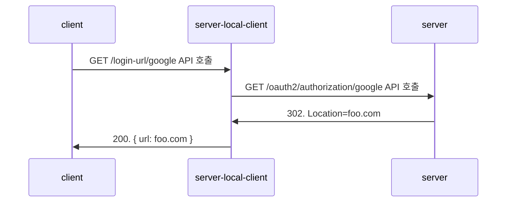

* TOC
{:toc}

클라이언트 개발자에게 `Google 로그인 페이지`로 이동하기 위한 URL을 응답해주는 별도의 API를 만드는 과정에서 발생한 오류 해결 과정을 기록합니다.

### 개요

현재 Spring Security 라이브러이에 OAuth 관련 라이브러리와 설정을 추가하였고, `/oauth2/authorization/google` URL로 요청시 302 Found 응답코드와 함께 `Location` 헤더에 구글 로그인 페이지로 이동하기 위한 URL이 제공되는 상태였습니다.

허나 클라이언트 개발자분이 현재 사용중인 라이브러리에서 `Location` 헤더 값을 불러올 수 없는 상태라고 하셔서 제가 별도의 API를 만들어드리려 했습니다.

그래서 저는 단순히 내 로컬에 요청을 보내고 그걸 다시 200 응답과 로그인 URL을 응답해주면 될거라 생각했습니다. 



- 기대했었던 상태 

하지만 문제는 `server-local-client`에서 `server`로 요청 시 302가 아닌 200을 응답하는 것이였습니다.

### 로컬에 요청을 보내는 클라이언트 정의 

`Spring Cloud OpenFeign`이라는 라이브러리는 외부 클라이언트를 인터페이스만으로 손쉽게 정의할 수 있는 라이브러리입니다. 그래서 다음과 같이 Api와 Client를 정의하고 호출을 하려 했습니다.

LocalApi.kt
```kotlin
@FeignClient(value = "local-api", url = "\${local.url}") // local.url: http://localhost:8080
internal interface LocalApi {
    @RequestMapping(
        method = [RequestMethod.GET],
        value = ["/oauth2/authorization/google"],
    )
    fun requestToOAuthGoogleAuthorization(): Response
}
```

LocalClient.kt
```kotlin
@Component
class LocalClient internal constructor(
    private val localApi: LocalApi,
) {

    fun requestGetGoogleLoginUrl(): String {
        // TODO: 왜 응답이 200으로 들어오는지 확인 필요
        val response = localApi.requestToOAuthGoogleAuthorization()
        val location = response.headers()["Location"]?.first() ?: throw IllegalStateException("Location header not found")

        return location
    }
}
```

다음 테스트 코드를 실행하고 디버깅을 해보았으나, response에서는 **200**을 응답하고 있었습니다!!

```kotlin
class LocalClientTest(
    val localClient: LocalClient,
) : LocalClientContextTest() {
    @Test
    fun shouldBeThrownExceptionWhenExample() {
        try {
            val location = localClient.requestGetGoogleLoginUrl()
            println(location)
        } catch (e: Exception) {
            Assertions.assertThat(e).isExactlyInstanceOf(RetryableException::class.java)
        }
    }
}
```


### 패킷을 통한 원인 분석

실제로도 200을 응답하는 것인가? Spring이 내부에서 200으로 자동으로 변환해주는 것이 아닌가 궁금했습니다.

그랬더니 흥미로운 사실을 발견했습니다. 패킷 상으로는 302를 정상적으로 응답해주고 있는 것이였습니다. [^1]

 

### Response 객체가 만들어지는 과정

Spring Cloud OpenFeign에서 제공하는 Response가 어떻게 만들어지는지 궁금했습니다. 혹시나 302등의 응답을 임의로 200으로 만드는 것이 아닐까 궁금했습니다.
	
redirect는 웹 브라우저가 환경에서는 바로 해당 URL로 이동하므로, HTTP Client도 마찬가지로 URL을 따라 이동한 결과를 응답해준다는 생각이 들었습니다.

그래서 [Spring Cloud OpenFeign 옵션](https://docs.spring.io/spring-cloud-openfeign/reference/configprops.html) 문서에서, `follow-redirect`라는 옵션이 있고 이 기본 설정이 `true`로 되어있다는 것을 발견했습니다. [^2]


그래서 해당 옵션값을 변경 후 원하는대로 302 응답을 받을 수 있게 되었습니다!

```yaml
spring.cloud.openfeign:
  client:
    config:
      example-api:
        connectTimeout: 2100
        readTimeout: 5000
        loggerLevel: full
      local-api:
        connectTimeout: 2100
        readTimeout: 5000
        loggerLevel: full
        followRedirects: false # 3xx 응답도 redirect url을 따라가지 않고 그대로 받는다. (default: true)
  compression:
    response:
      enabled: false
  httpclient:
    max-connections: 2000
    max-connections-per-route: 500
```

### 후기

글을 작성하는 지금 시점에서는, 사실 어떻게 보면 리다이렉트가 되기 때문에 바로 해당 설정을 떠올릴 수도 있지 않았을까? 하는 생각도 듭니다.

하지만 제가 최근에 TCP, HTTP를 공부하고 지인을 통해 `wireshark`로 패킷 분석도 하는 방법도 배웠는데, 이를 실제로 활용해보고 트러블슈팅 하는데에 힌트가 되어 삽질하는 시간을 조금이라도 줄였다고 생각이 듭니다.

트러블 슈팅은 항상 어떻게 보면 해답은 간단하지만, 그 해답을 찾아가는 과정 자체는 간단하지 않은 것 같습니다.

그리고 다시 한번 문제 해결을 하기 위해서는 이러한 기초 지식이 탄탄해야 한다는 것을  깨달으며 글을 마칩니다.

### 각주
[^1]: `wireshark`라는 패킷 캡처 프로그램을 통해 네트워크 상에 패킷이 어떻게 오고가는지 볼 수 있습니다.
[^2]: <https://docs.spring.io/spring-cloud-openfeign/reference/configprops.html>
