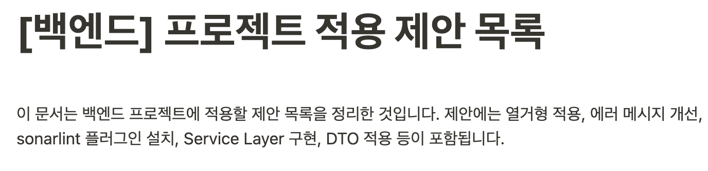

어느덧 2023년의 절반이 훌쩍 지나갔고, 특히 작년 연말에 회사를 옮기게 되어 이에 대한 회고를 한번 해보려고 한다. 글의 주제도 이직한 회사에 대한 내용이 대부분일 것 같다.

### 이직

작년 12월에 산업기능요원 신분으로 처음으로 회사를 옮기게 되었다. 비록 내가 기존에 쓰던 스택인 Java/Spring으로 전환하던 프로젝트는 예전에 드롭되어 회사에서는 기존에 사용하던 Koa/JS 조합을 계속해서 사용하고 있었다.

오랜만에 사용하는 기술 스택이라 어색한 면이 많았지만, 앞으로 그나마 백엔드 업무에만 집중할 수 있다는 것에 위안이 되었다. Java/Spring 공부를 하면서 배운 내용들도 적용해 보면서, 서로의 장점을 극대화할 수 있는 방향으로 개발하려고 마음을 먹었다.

### 아키텍처

처음 회사 코드를 보았을 때는 예전에 내가 고등학생 때 처음으로 Node.js 백엔드 개발을 할 때 구조와 매우 유사하였다. route(controller)에서 모든 비즈니스 로직을 처리하다 보니 한 파일에 상당히 많은 코드들이 응집하게 될 수밖에 없고, API나 요구사항이 추가될수록 유지 보수 난이도가 급격하게 상승하였다.

사실 완전 초기 스타트업에서는 이 구조가 문제가 되지 않는다. 아니 오히려 더 빠르게 개발할 수도 있어서 더 나은 선택지가 될 수도 있다. 하지만 지금은 이미 규모가 어느 정도 잡히게 되면서 이 구조는 많은 문제를 가지고 있다고 판단하였다.

우선 입사 1~2달 동안은 계속 **지켜보기만** 하였다. 입사한지 얼마 되지 않은 상태로 이런 구조를 바꿔야 한다고 의견을 제시하는 것은 반발을 얻을 수도 있어, 구성원들과의 신뢰가 먼저라고 생각했다. 그래서 내가 생각하는 문제점들, 프로젝트에 적용하면 좋을 만한 내용들을 내 개인 노트에 조금씩 기록하기 시작했다.

입사한지 6개월이 지난 지금 시점에서는, 그래도 작성한 내용의 절반 이상은 적용하였다. 사실 별거 아닌 내용들도 많지만, 코드를 어느 정도 개선하는 데에 기여를 하게 된 것 같아 뿌듯했다.

하지만 아직도 적용해야 할 굵직한 내용들이 많다. 이 부분은 앞으로도 계속 적용하고 개선해나갈 예정이다.

### 테스트 코드의 적용

회사에서 데이터 모델에 대해 단위 테스트를 적용해서 개발을 진행하고 있다. 단위 테스트는 확실히 작성하기도 쉽고, 들인 노력에 비해 많은 테스트 케이스를 커버하고 있어 효과가 좋다. 단위 테스트는 앞으로도 계속해서 작성할 예정이다.

그러나 단위 테스트 만으로는 확실히 부족하다는 생각이 들었다. 사용자와 가장 맞닿아 있는 e2e 테스트를 작성하지 않으면, API를 호출했을 때 제대로 통합이 이루어져 호출이 되는지 파악이 되지 않기 때문이다.

현재는 테스트 자동화와 E2E 테스팅을 하기 위한 test profile에 대한 환경이 구성되어 있지 않다. 서비스 출시를 앞두고 있는 상황에서 안정화를 위해 최우선적으로 해야 할 task라고 생각된다.

번외로 ATDD에 대해서도 흥미가 생겼다. 막상 PRD 리뷰 회의에 참석한다고 해도 항상 내가 생각한 것과 달라지거나 내가 누락한 내용들이 있는 경우도 있었다. 내가 PRD 회의에 참여한 후 그에 대한 기반으로 인수 테스트를 작성하고 기획자/QA 분과 인수 테스트 리뷰를 해도 좋을 것 같다는 생각이 들었다.

### 모델 저장소 분리 프로젝트

4월~5월 초까지 모델 관련 저장소를 분리하는 작업을 진행하였다. 백오피스 구축에 앞서, 동일한 데이터베이스 모델을 사용하기 위해 npm package를 새로 구축하는 작업이었다. typescript 기반으로 재구성하였고, 하위 호환성을 맞추기 위해 여러 삽질들을 하면서 맞추게 되었다.

쉽지만은 않은 작업이었다. typescript 삽질도 해보고, 모델을 생성해 주는 라이브러리에서 예전 버전의 코드 형태로 생성해 주는 등의 많은 이슈들도 있었다.

지금은 당장은 이를 적용하고 나서는 오히려 번거로워졌다. 기존에는 모델 관련 코드를 수정하고 커밋 후 바로 적용하면 되지만, 지금은 모델 저장소에서 수정 후 배포하고, 기존에서 이 패키지를 가져다 쓸 때 버전 업그레이드를 해줘야 하기 때문이다. 하지만 typescript 기반으로 작성되어, 나중에 다른 프로젝트에서 이 모델 패키지를 가져다 쓴다면 꽤나 효과가 커질 것으로 기대한다.

### 백엔드 개발 문화 개선

백엔드 개발하면서도 문화 개선에도 관심이 많다. commit 메시지나 Pull Request와 리뷰를 활용하는 것뿐만 아니라 페어 프로그래밍도 곧 해보려고 한다. 아직도 프로젝트 전반적으로 아쉬운 코드들이 많이 남아있는데, 이를 제거해나갈 예정이다.

문화를 개선하는 것은 채용 브랜딩 및 홍보에도 큰 도움이 되기에, 좋은 개발자분들을 모셔오기 위해서라도 꼭!! 해야 된다고 생각된다.

### 잘한 것과 아쉬운 것, 그리고 느낀 점

내가 생각하는 회사에서 잘한 점은 다음과 같다.

- 나는 절대 더러운 코드를 양산하지 않겠다는 마음가짐
- 단위 테스트와 그로 인한 꾸준한 리팩토링
- 아키텍처에 대한 다양한 시도와 변화
- 다양한 문화 개선을 위한 시도

그리고 내가 생각하는 아쉬운 점, 그로 인해 개선해 볼 만한 점은 다음과 같다.

- E2E 테스팅 환경 구축을 아직 하지 못한 것
- 코딩 컨벤션을 갖추지 못해 코드 스타일을 통일하지 못한 것
  - 입사 초반에 미리 잡았어야 하는 아쉬움이 있다.
- 개발 시 기획에 정의된 내용을 누락한다든지, 잘못된 방향으로 개발한 것
  - 미리 문서를 공유한다든지, 중간 체크, 인수 테스트를 미리 작성하는 식으로 조금씩 맞추어 나가야 할 것 같다.
- 프런트와 잦은 커뮤니케이션 미스 발생
  - REST API 설계 제대로 공부
  - 프런트 개발자에게 요청 시 환경과 테스트할 수 있는 정보같이 전달
- API 스펙 함부로 변경 금지!!
- 공식문서 잘 읽어보기

느낀 점으로는 다음과 같다.

- 회사는 기다려주지 않는다.
  - 회사는 새로운 기능 개발, 사업에 대해서만 관심이 있다. 새로운 기술 도입을 위해 일정이 미뤄지는 것은 말도 안 된다. 나는 능숙하게 해낼 수 있도록 숙련도를 계속 올려야 한다.
- 쓰레기는 보는 즉시 치워야 한다 (보이스카우트 원칙)
  - 나중에 쓰레기가 된 코드는 치우기 힘들다. 바로바로 치우는게 훨씬 낫다.

### 회사의 Sass 출시, 그리고 앞으로는?

회사가 곧 Sass 출시를 앞두고 있다. 그로 인한 안정화 작업이라고 생각되는 것은 앞서 언급했듯 당연히 **테스트**다. Typescript 전환을 위해서도 많은 테스트 커버리지가 필요하다. 무조건 테스트가 1순위이다.

이제 앞으로 내가 해야 된다고 생각하는 것들은 다음과 같다.

- [ ] E2E 테스팅 환경 구축
- [ ] **주요 개발 내용 문서화**
- [ ] 의존성 관리 라이브러리 도입
- [ ] TypeScript로 모델 부분부터 마이그레이션
- [ ] 디자인 패턴, 객체지향과 설계 원칙 적용
- [ ] 아키텍처 정립
- [ ] 프런트에게 전달할 SDK 혹은 문서 레퍼런스 찾아보기
- [ ] ATDD 공부해서 적용 제안해 보기

앞으로 남은 하반기도 열심히 달려보아야겠다.
